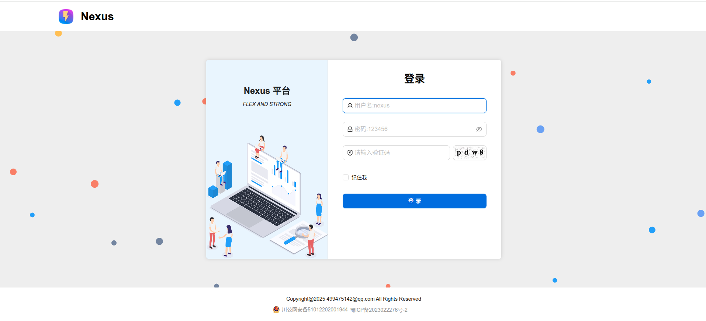
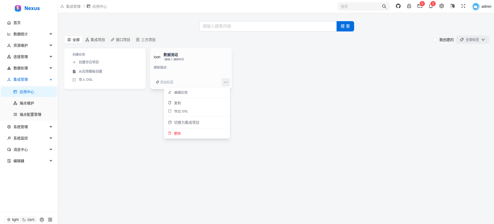
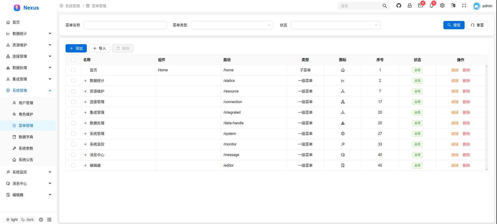

# Nexus


# 集成信息管理平台，用于将多种协议、多种系统进行耦合，通过配置服务并发布，可做到让不同厂商的系统进行最简化的系统对接

# 框架技术： 
- react@18.3.1  
- antd@latest 
- rsbuild 构建工具
- zustand@latest 状态管理
- sass@latest
- react-router@latest
- react-dom@18.3.1
- axios@latest
- @tanstack/react-query@latest
# 注意
    其中对axios进行了二次封装，其前后台交互的数据是json，并将数据进行了加密处理，发送到后端，后端项目基于springboot3.4.5+jdk21+mybatis-flex(后续开放)

# 支持丰富的交互协议，http、soap、RPC、hl7(后续支持)、file 等等，其包含的功能大部分由 apache camel 中的组件所支持，也可自行扩充其中的组件

# 整体系统界面如下图所示

## 登录


## 应用中心


## 菜单管理


更加详细的介绍，敬请期待！！！


## Setup

Install the dependencies:

```bash
bun install
```

## Get started

Start the dev server:

```bash
bun run dev
```

Build the app for production:

```bash
bun run build
```

Preview the production build locally:

```bash
bun run preview
```
